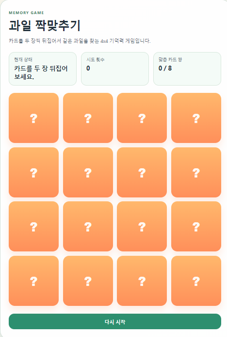

# puzzle-game

## 카드 데이터 생성 방식

현재 퍼즐 게임에서 카드 데이터는 `js/game.js` 파일의 `createCards()` 함수를 통해 생성됩니다. 이 함수는 게임 시작 시 호출되며, 다음과 같은 방식으로 작동합니다:

1. **과일 데이터 소스**: `js/utils.js` 파일에서 정의된 `FRUITS` 배열을 사용합니다. 이 배열은 18개의 과일 이모지로 구성되어 있습니다: `["🍎", "🍌", "🍇", "🍉", "🍒", "🍑", "🍍", "🥝", "🍓", "🥭", "🍈", "🍐", "🍊", "🍋", "🥥", "🍅", "🍈", "🍐"]`.

2. **카드 생성 로직**:
   - `FRUITS` 배열을 두 번 복사하여 총 36개의 과일 요소를 만듭니다 (`[...FRUITS, ...FRUITS]`). 이는 각 과일이 짝을 이루기 위한 것입니다.
   - `shuffle()` 함수를 사용하여 이 36개의 요소를 무작위로 섞습니다. `shuffle()`은 Fisher-Yates 알고리즘을 기반으로 배열을 섞는 유틸리티 함수입니다.
   - 섞인 배열을 `map()`으로 순회하며 각 과일에 대해 카드 객체를 생성합니다.

3. **카드 객체 구조**: 각 카드는 다음과 같은 속성을 가진 객체입니다:
   - `id`: 카드의 고유 식별자 (0부터 시작하는 인덱스).
   - `fruit`: 해당 카드의 과일 이모지.
   - `flipped`: 카드가 뒤집혔는지 여부 (초기값: `false`).
   - `matched`: 카드가 짝을 맞췄는지 여부 (초기값: `false`).

## 실행화면

결과적으로, 게임은 항상 36개의 카드(18쌍의 과일)를 가지고 시작하며, 각 카드는 위의 속성을 포함한 객체로 표현됩니다. 이 데이터는 게임 상태 관리와 보드 렌더링에 사용됩니다.

### 최근 변경 사항 (4x4 → 6x6 확장)
- **과일 종류 증가**: `FRUITS` 배열을 8개에서 18개로 확장하여 6x6 그리드(36칸)를 지원합니다.
- **보드 레이아웃 수정**: CSS에서 그리드 컬럼을 `repeat(4, 1fr)`에서 `repeat(6, 1fr)`로 변경하여 6열 그리드로 조정했습니다.
- **기능 유지**: 기존 게임 로직(짝 맞추기, 뒤집기, 상태 관리 등)은 그대로 유지됩니다. 카드 수만 증가했습니다.